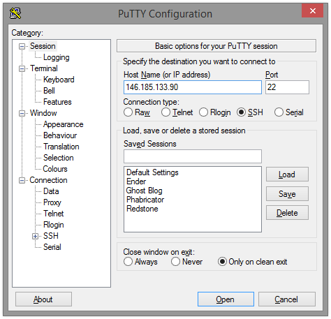
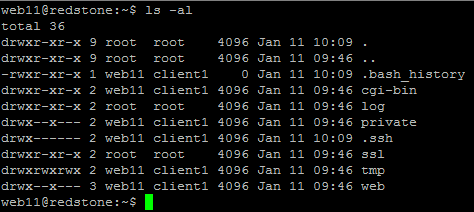
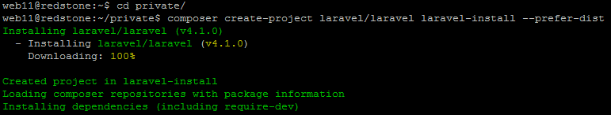
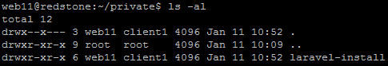
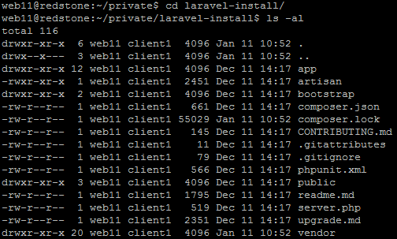
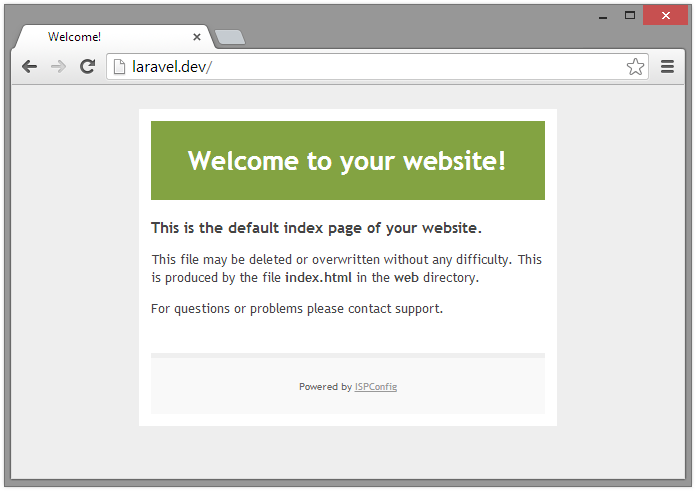
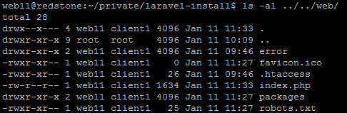
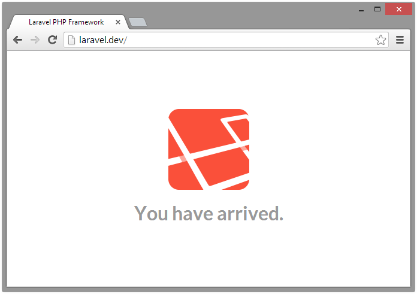
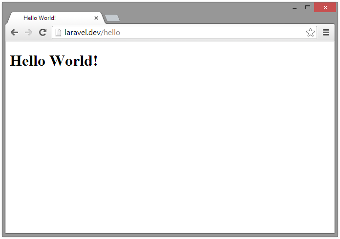

I see a lot of posts around of people struggling to get Laravel working, or installing it incorrectly using rewrites to mask the fact their Laravel installation is in fact in the document root, which is entirely wrong and insecure on many levels, although this is how many other frameworks such as Wordpress and CodeIgniter work, which I guess is why many people tend to have issues trying to do it this way.

## Before we get started

Theres a few things that should be noted about Laravel and how it works.

Laravel 4 uses composer, a package manager for PHP, much like Maven for Java, Ruby Gems, etc. Composer will manage your dependencies, keep them up-to-date, ensure you, your team and environments are all using the same versions of your dependencies and most importantly stops you from distributing other peoples code/libraries you shouldn't be or might not want to for bandwidth or storage reasons.

There are some prerequisites you will need from your hosting. SSH or Command Line Interface access, PHP 5.4 or greater and have the PHP mcrypt module enabled. The PHP version and module shouldn't be an issue as these should be available as standard from all hosts. SSH access can be a rarity and whilst it isn't absolutely essential, it will certainly make Laravel a huge amount harder to work with and manage if you don't have it.

If your host doesn't offer the above three prerequisites I would urge you to move to a more suitable provider before attempting to setup Laravel. [TSOHost](https://www.tsohost.com/product/web-hosting) is a personal favourite of mine, its super simple, extremely cheap and perfectly stable. If your more experienced and are looking to setup your own server [Digital Ocean](https://www.digitalocean.com/) and [Linode](https://www.linode.com/) are amazing for Cloud-based VPS hosting.

When setting up Laravel nothing from the installation should be located in your document root (thats the publicly accessible folder located on the server, usually called public, public_html or web), other than the contents of Laravel's public folder. This will make more sense as we get further into setting up Laravel.

## Getting Started

First things first we are going to SSH into our hosting. Depending on your host you can find your details in your signup email or on their control panel. You'll need the IP address, Port (by default this is 22), Username and Password.

[Putty](http://www.chiark.greenend.org.uk/~sgtatham/putty/download.html) is my client of choice. If you're on a *nix based OS I assume you know what you're doing.

Put in your hosting IP address and port, you will be prompted for the username and password after you've connected by clicking the open button.



After successful connection you will be greeted by a terminal console, this is where most of the installation of Laravel will take place.

The first thing you want to do is run the command `ls -al`. This will give you a directory listing of the folder you're currently in.



The directory structure will vary depending upon the host, but should all follow the same basic principles.

- `log` contains our webserver logs
- `private` is where we can store applications and private files that should never be accessible to the public.
- `ssl` is our publicly accessible folder when the website is accessed over https
- `web` is our publicly accessible folder when the website is accessed over http. (Depending upon the host, this could be called public, public_html, etc. Check with your host if you're not sure)

> Note: You may not have a private folder, but that doesn't matter, this location can be anywhere, so long as it is outside of the document root

## Installing Laravel

So if you read the 'Before we get started' section of this post, you'll know that our Laravel installation should be out of the document root, away from the public access.

You guessed it, we're going to put our Laravel installation into the `private` folder, although theoretically the Laravel installation could be located anywhere on the server.

Its important Laravel is installed out of the document root so people cannot access your configurations, cache and session data, which could potentially give them unauthorised access into your application, database server or even ssh access to your server.

So we'll change directory to the `private` folder and run the composer `create-project laravel/laravel your-project-name --prefer-dist` command. Composer will then install Laravel and all its dependencies automatically



> Instructions on installing composer can be found [here](http://getcomposer.org/download/). If you are using shared hosting you will likely need to use the [local installation](http://getcomposer.org/doc/00-intro.md#locally) method

The installation can take several minutes. Once completed you should now have a folder with the same name as your project name, in this case `laravel-install`



Inside our folder, a shiny new Laravel installation, complete with all dependencies, ready to use.



You should now edit your configuration files as necessary, they're located at `app/config` of the Laravel installation.

But we're not quite finished yet. If we visit our website you'll notice we still have our hosts default page. This is because we have not yet moved the contents of Laravel's `public` folder into our document root.



To do this we can simply use the `cp` command to copy and paste the contents of the `public` folder to our document root which is located at `../../web`

```sh
cp -r public/* ../../web
```

Our document root will now contain the contents of Laravel's `public` directory



> Ensure you have removed `index.html` from your document root as this will take priority over `index.php`

Next we need to edit `index.php` to tell it where our Laravel installation is located.

```php
<?php
/* Redacted */

/*
|--------------------------------------------------------------------------
| Register The Auto Loader
|--------------------------------------------------------------------------
|
| Composer provides a convenient, automatically generated class loader
| for our application. We just need to utilize it! We'll require it
| into the script here so that we do not have to worry about the
| loading of any our classes "manually". Feels great to relax.
|
*/

require __DIR__.'/../private/laravel-install/bootstrap/autoload.php';

/*
|--------------------------------------------------------------------------
| Turn On The Lights
|--------------------------------------------------------------------------
|
| We need to illuminate PHP development, so let's turn on the lights.
| This bootstraps the framework and gets it ready for use, then it
| will load up this application so that we can run it and send
| the responses back to the browser and delight these users.
|
*/

$app = require_once __DIR__.'/../private/laravel-install/bootstrap/start.php';

/* Redacted */
```

<script src="https://gist.github.com/iWader/8369920.js?file=index.php"></script>

We also need to edit our `bootstrap/paths.php` to tell Laravel where our document root is now located.

```php
<?php

return array(

        /* Redacted */
        
        /*
        |--------------------------------------------------------------------------
        | Public Path
        |--------------------------------------------------------------------------
        |
        | The public path contains the assets for your web application, such as
        | your JavaScript and CSS files, and also contains the primary entry
        | point for web requests into these applications from the outside.
        |
        */

        'public' => __DIR__.'/../../../web',

        /* Redacted */

);
```

If we visit our site now we should see the Laravel installation is now working, and ready to use.



But obviously this is just a default Laravel installation, theres no content or site, its just the Laravel landing page

Deploying is as easy as 1 2 3. You simply need to replace the contents of `private/laravel-install` with your newly developed version. There should be no need to copy the contents of Laravel's \`public\` directory and other business as this shouldn't change, unless you are upgrading Laravel versions. (i.e: 4.0 to 4.1, etc.)

You then need to copy the contents of your `public` folder to your document root if you have made any changes to your assets, such as css, images, js, etc. that are located in your public folder. - Updated as per [reddit post](http://www.reddit.com/r/laravel/comments/1v0wl0/installing_laravel_with_shared_hosting_needlessly/).

We now have our updated application with new routes, nice.



## Nginx

> This section is for users who are using the nginx webserver rather than apache. If you are using shared hosting you are more-than likely using apache so can ignore this section.

If, like me, you are using nginx instead of apache, you will need to add some rewrite rules to your vhost configuration. This acts just like apache's mod_rewrite, but nginx does things a little differently, the rewrite configurations have to go directly into the vhost configuration usually located at `etc/nginx/sites-avaliable/website.vhost`. This can vary depending upon your OS.

```
location / {
    index   index.php;

    if ( !-f $request_filename )
    {
      rewrite ^ /index.php last;
      break;
    }
}
```
