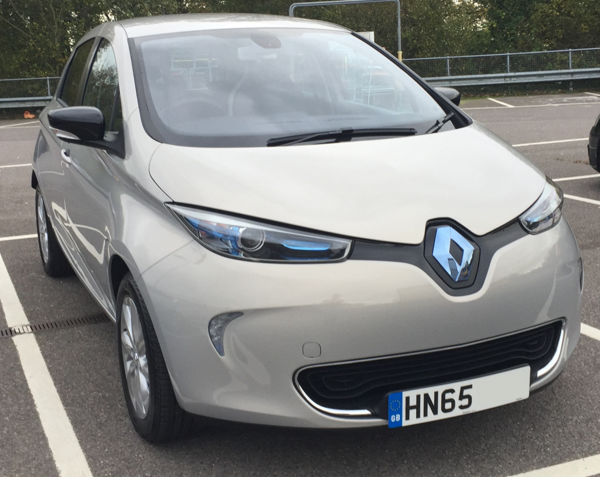
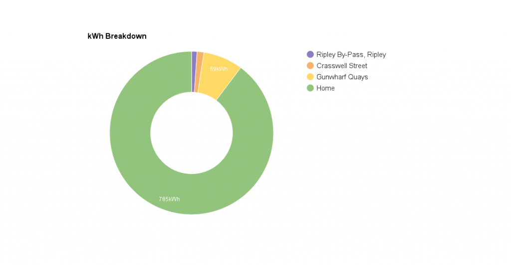
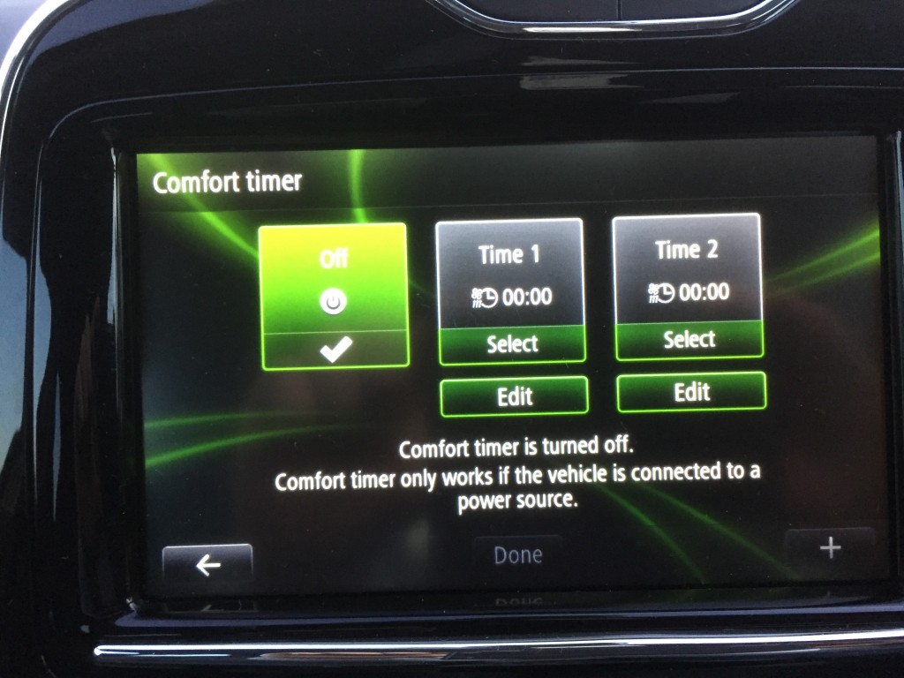
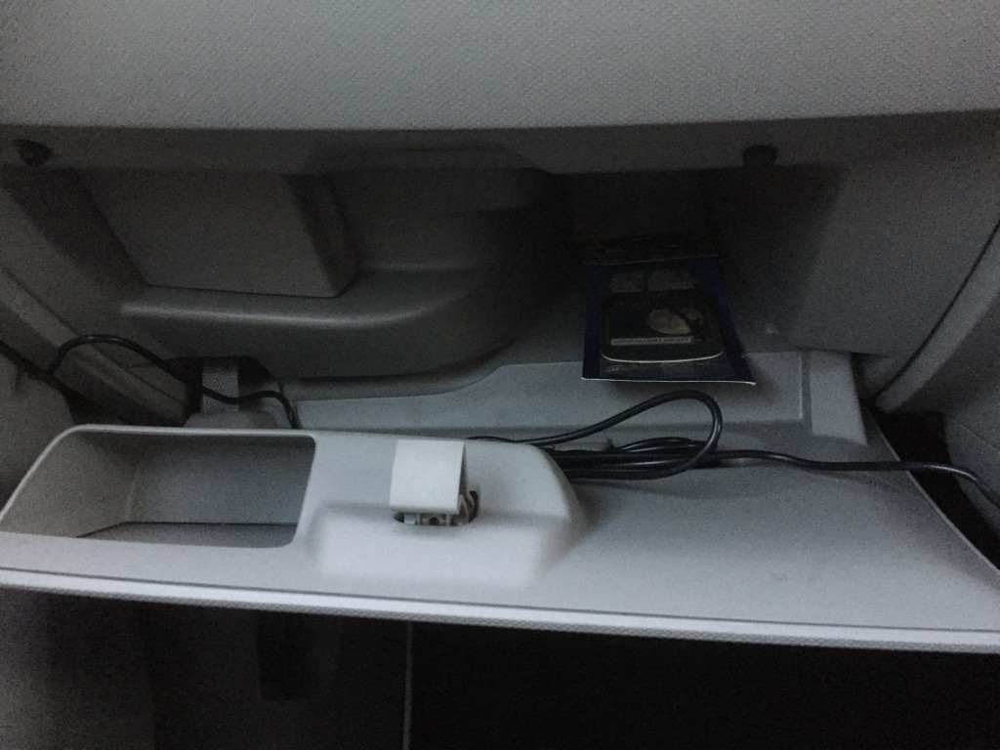

Back in April 2015 I started looking for a new car, something to replace my ageing 2004 Purgeot 206, so it had to be small, cheap to run and most importantly cheap to insure.

Most usual factors to me aren't important, I don't have any kids so practicality and space isn't a huge deal. I rarely do a huge shopping trip or travel long distances in the car, It's usually just me and my partner, in the local area and commuting.

What was important to me was the ride height, I'm quite tall and often find it awkward getting in and out of low cars. The entertainment system needed to link to my phone and have hands free (I know these things are pretty standard for modern cars but I upgraded from the 2004 Purgeot being my first ever car). The most important factor though, as already mentioned, is the price. If it wasn't cheap I would have never considered even buying a brand new car.

In June I placed my order for the Zoe Dynamique Nav (previously known as the Dynamique Intens), the process was quite shaky, bad communication and it took a long time. I eventually was able to collect the car at the start of November, which was slightly ahead of schedule, having originally been given the date of 24th November.

Within the first couple of weeks I found a few faults with the car, nothing major, just odd things like the tyre pressure sensor not working, Z.E Services (online connectivity) not working, USB port not picking up devices, etc. nothing that stopped the car functioning. The dealership didn't want to know, in fact they didn't really know anything about the car at all. When I collected the car it was a quick check over and I was shown how to work the radio as, and I quote "I probably know more than the salesman"... right, even though he was supposed to be the specialist for the Zoe.

I put that bad experience down to the dealership and not Renault themselves as they've been extremely helpful and have resolved all my problems since getting in touch with them, bypassing the dealership. The resolution to my problems was to update the car's software, by taking the SD card, plugging it into a computer and updating via. the [Renault RLink](https://gb.rlinkstore.com/home) software. A painless process, which Renault said the dealership should have done before handing the car over to me. Funnily enough, once the update has completed, everything started working! Renault even phoned me back, exactly when they promised. Who ever heard of such a thing, a company actually phoning back when they said they would.

I have since, several times visited the dealership, asking for several things, such as fitting a dashcam and they never call back, despite chasing many times, so I'd avoid Sewards if at all possible! Ironic considering all of the "benefits" they promote.

## Price

The value of the car is just shy of £21,000, which for a small hatchback is quite expensive given it's only a Renault. Currently however, any plug-in vehicles are subsidised by the government in which they contribute 35%, up to £5,000 towards the value of the car and by the time the Renault deposit contribution and deposit from myself was applied the final finance value was just over £10,000.

I purchased the car on a 36 month PCP contract making my monthly payments towards the car just £121.37. This price was leasing the battery rather than purchasing, which I don't think Renault allow you to do. With the Nissan Leaf they give you the option to purchase the car and the battery or purchase the car and lease the battery. The good thing about leasing the battery is that you're not responsible for it, at least in the case of the battery ever degrading to under 80% its original capacity, Renault will replace the battery. You do however have to include the value of the battery under your car insurance which takes the insurance value up to £21,000.

The battery lease is based on how many miles you plan to do annually. I opted for 10,000 miles which they priced at £82.33. So all in all the car costs me £203.70 per month.

## Running Cost

I've just hit 2,000 miles after 3 months, breaking down the cost; We pay approx 17p/kWh on our energy tariff, I'm averaging 2.55mile/kWh. So to work out the cost per mile, 17/2.55 gives you 6.67p/mile. Now we don't have solar panels installed and nor do we have a fixed energy tariff so take that cost with a pinch of salt. If you're on a fixed tariff then you'll certainly find energy at a cheaper rate. Renault say it can be as cheap as 2p/mile, which I guess if you have solar panels you might be able to hit something closer to that, but even 6.67p/mile is hugely cheaper than the cost of a normal car.

[caption id="attachment_687" align="aligncenter" width="1024"] Renault Zoe - kWh breakdown[/caption]

## ECO Mode

The car has two modes of driving, ECO mode and normal. The ECO mode dulls the air conditioning, accelerator, and also limits the top speed to 60mph, but even with it enabled acceleration is still faster than your average hatchback. Heating takes a while to get up to temperature, but quite often I find myself heating the car then switching ECO mode on once its a comfortable temperature. You can also 'pre-heat' the car via. the online services or the comfort timer (More on that later).

In normal mode you'll find the car super speedy and responsive on the accelerator which is where the fun comes in. The cars ability to pull off the line is outstanding, most people seem to think they'll be like milk floats, which couldn't be further from the truth. The top speed in normal mode is still restricted to 84mph, but at that speed you'll be zapping the battery and won't be traveling a great distance. Motorway driving I put the cruise control on and sit at 70mph which consumes a much happier amount of juice.

## Range

The range of the car varies massively based on how you drive and the outside temperature. Renault say the car will do 120 miles on a full charge, of course this is in ECO mode and if you drive extremely carefully, but I wouldn't say its stupidly unrealistic, but you certainly won't get that range if you're not trying.

Shortly after receiving the car I did a trip up to London, parking in Wimbledon, which is about a 64 mile trip one way. I had pre-heated the car and drove in ECO mode sticking to a slow 55mph all the way up the A3 from Portsmouth. When I first set off the car said it could manage 80 miles, bearing in mind it calculates based on your previous driving on the trip computer. When I arrived it said it could still manage another 45miles, so I wouldn't say that 120 miles is greatly unrealistic. I did charge the car whilst I was out for the day so I can't say if it would have actually done those 45 more miles. This trip was also in the wet with wipers going the whole way and lights on (I've no idea just how much battery those waste, I've never really noticed, but its a factor to consider).

On average I find myself charging the car 1-3 times a week so far, depending on how many times I travel down into the city (about a 20 mile trip there and back). A full charge costs around £4 on average but we're not on a fixed tariff so take that with a pinch of salt. My commute is a 4 mile trip one way so It'll happily get me to work and back all week and then some without having to charge it.

I mentioned temperature earlier as this has a drastic effect on the battery when its below or near freezing. In the middle of January temperatures were reaching -6°C and I was struggling to get 40 miles out of the car, so I suspect in freezing temperatures the car has to heat the battery or motor, or something along those lines. As of writing we're around 10°C in the mornings and everything is back to normal the car is comfortably doing 70 miles (not in ECO mode and heater on) again.

Putting the heater on full in ECO mode draws 1kWh from the battery, in normal mode it draws up to 4kWh, so using the heater does have an effect on the distance, but thats expected, it _has_ to use the battery to heat the car. Theres no combustion engine to draw heat from like traditional cars (at least older ones).

## Charging

As part of the government subsidy another grant is given to help with the cost of installing the equipment needed to charge the car. This covers 75% of the installation cost, up to £700, however with the Zoe, Renault are covering the final 25% when you have a charger installed with their partner, Chargemaster, meaning the home installation is free. When having the home charger installed all I had to pay was £50 for a new circuit breaker to be installed, which I think is standard with the ZOE because it uses a 7kW charger.

There are several types of charger for electric vehicles, however the Zoe uses a Type 2 cable (also known as a Mennekes charger), this the best kind of charger for EVs as the Type 2 socket can range from 3kW up to 70kW on the single cable, allowing you to charge the car in as little as 30 minutes when used with compatible charge points.

I believe other EVs such as the Nissan Leaf don't come with this cable as standard and can cost in the region of £500! Instead they give you a standard 3 pin UK plug which can take 12 hours or more to fully charge! It has conveniently earned the name "granny cable". The ZOE comes instead with the Type 2 cable as standard and the home charger is a 'fast' 7KW charger taking a full charge to around 4 hours.

Theres quite a few types of chargers for EVs which, to be honest, I have found damn confusing at times. The ZOE simplifies it and just gives you a Type 2 charger, one cable to rule the all. None of the messing about with multiple types. Although the 3pin UK plug is an option you can purchase, I'm not entirely sure why you would bother?

## Z.E Services (Online/Mobile App)

The app allows you to remotely monitor you car, its charging status, etc. but it also does something I've not ever seen on a car before, you can control the air conditioning from your phone, pre-heat your car if you're heading back to it, set the comfort timer and even schedule a charge to happen.

Scheduling of the charge can be a brilliant feature, for example, you may have solar panels and so the cheapest time for you to charge the car is during the day when its sunny. So lets say you've left the car plugged in, but not necessarily charging, you could schedule the charge to start at 12 noon so that you're using as much of the solar power as possible.

## Interior and practicality

The Zoe is very spacious inside, looks great, and has a very cool centre console system. Theres plenty of space in the back for 3 kids, or with a squeeze 3 adults, but room for 2 adults comfortably. Theres plenty of leg room in the back, even for me and I'm 5ft 11in. The boot space is huge with plenty of space for a couple of large suitcases and then some.

The glovebox however lets it down (at least in the UK version), sadly its mostly taken up by the fuse box and internals under the bonnet as they've not bothered to move things around with it being a French, usually left hand drive car, which pretty much makes the glovebox pointless. You can't even fit the user manuals in there.

I opted for the luxe package which gives me the central arm rest, rear head restraints and the boot net (I really wanted the arm rest). I also opted for the standard delivery pack which gives you made to measure and matching interior floor mats in the front and back as well as the safety kit (<sarcasm>I always wanted one of those</sarcasm>).

## Entertainment System and Sat Nav

The entertainment system at times can be a little slow to respond, mainly when its just been turned on, but its always worked flawlessly when linking to my phone via. bluetooth and USB. I find the placement of the USB port and SD card quite inconvenient, its down in the small storage pot just below the centre console, which a) doesn't look great and could have easily been hidden away in the glove box as most other cars do b) reduces the usability of said storage pot in fear of breaking the USB port.

The Sat Nav is quite basic and is powered by TomTom, its slow to give you direction often giving it too late to maneuver or even completely after you've passed the turnoff. I wouldn't recommend if you're greatly uncertain of where you're driving and often myself rely on my phone rather than the built-in Sat Nav. It does have the ability to locate a compatible charge point if you're caught short on range, but again the mobile apps are much better (More on this later).

Through the entertainment system theres also quite a few options you can control on the car. A good example is the ability for it to automatically lock the doors after you start driving, you can turn it on and if you want to, theres quite a few other options too.

## Charging Schemes

Along with the home charger install theres plenty of public schemes about that provide use of their chargers, sometimes for free but often pay as you go or monthly subscription. With the Chargemaster home installation they provide you with 6 months subscription to their service for free, called Polar Plus, which would usually cost £7.85 a month. Along with their monthly subscription service they also provide a pay as you go service called Polar Instant if you don't plan on being a frequent user of their network.

Through Polar Plus you can also track your usage on their network, including the charger installed at home, which details the kWh consumed and time spent plugged in.

There are also other schemes such as Ecotricity which provide a **free to use** network of the fastest chargers, those that allow you to charge to 80% in ~30 minutes, along the motorway networks in the UK. You do have to register in advance, but everything is completely free (as of writing). I don't think there are plans to charge for their network as of yet.

There is also Pod Point which are currently in the transition of moving to a pay as you go scheme, however some charge points are still free to use if you purchase the access card for a one-off £12.50. With the new pay as you go Pod Point you use the mobile app to access, pay and locate charge points.

Many of the providers you do have to register in advance for as they provide you with an access card so be aware if you plan on making longer journeys.

## Just Park

Along with the charging schemes above there is also the Just Park app in which people rent out their driveways some of which also provide access to their charging facilities (sometimes for an extra fee). This is how I parked on my trip to London, which I mentioned earlier, I was guaranteed a parking spot as I had booked and paid in advance, no hassle, no troubles parking in London and charging my car for the journey back home.

## Conclusion

The car itself is great, covers a reasonable distance for city driving and short to medium commutes. The cost of running the car is hugely cheaper compared to conventional cars and its insurance group 17E which makes it around the mid-range for insurance. Modern EVs are definitely a viable option and worth considering if you don't have a long commute or travel long distances regularly.
