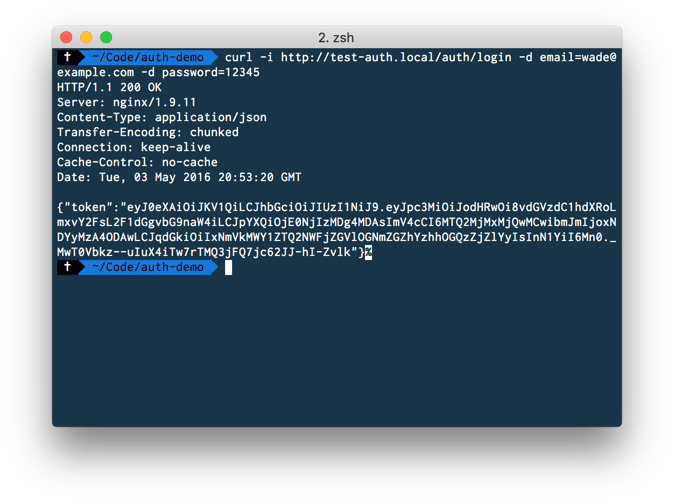
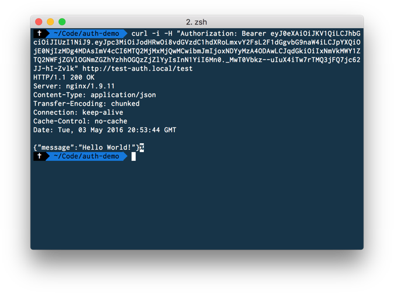

Recently I've been developing a [Vue.js](http://vuejs.org/) site using [JSON Web Tokens](https://jwt.io/) (or JWT) for the authentication. Theres been a long standing library for Laravel, [tymon/jwt-auth](https://github.com/tymondesigns/jwt-auth). It's never been greatly compatible with Lumen, never mind the shakeup with the auth system in 5.2.

The author has however just released an [alpha for version 1](https://github.com/tymondesigns/jwt-auth/releases/tag/1.0.0-alpha.2) which addresses the Lumen problem and thus far all seems good. There is no documentation as of yet so I'll quickly run through an install for Lumen 5.2.

All the code for this demo can be found on my [GitHub](https://github.com/iWader/jwt-auth-demo) too.

First things first, lets go ahead and create a new project with Lumen and install the [tymon/jwt-auth](https://github.com/tymondesigns/jwt-auth) package.

```sh
composer create-project laravel/lumen ./auth-demo
cd ./auth-demo
composer require tymon/jwt-auth:"^1.0@dev"
```

Now we have to make Lumen load the service provider, so if we open `app/Providers/AppServiceProvider.php` and add the following to the `register()` method.

```php
$this->app->register(\Tymon\JWTAuth\Providers\LumenServiceProvider::class);
```

Next we need to setup a config file so we can tell Lumen which auth drivers to be using the JWT auth driver we just installed. Create a new file at `config/auth.php` with the following contents

```php
<?php

return [

    /*
    |--------------------------------------------------------------------------
    | Authentication Defaults
    |--------------------------------------------------------------------------
    |
    | This option controls the default authentication "guard" and password
    | reset options for your application. You may change these defaults
    | as required, but they're a perfect start for most applications.
    |
    */

    'defaults' => [
        'guard' => env('AUTH_GUARD', 'api'),
    ],

    /*
    |--------------------------------------------------------------------------
    | Authentication Guards
    |--------------------------------------------------------------------------
    |
    | Next, you may define every authentication guard for your application.
    | Of course, a great default configuration has been defined for you
    | here which uses session storage and the Eloquent user provider.
    |
    | All authentication drivers have a user provider. This defines how the
    | users are actually retrieved out of your database or other storage
    | mechanisms used by this application to persist your user's data.
    |
    | Supported: "session", "token"
    |
    */

    'guards' => [
        'api' => [
            'driver' => 'jwt',
            'provider' => 'users'
        ],
    ],

    /*
    |--------------------------------------------------------------------------
    | User Providers
    |--------------------------------------------------------------------------
    |
    | All authentication drivers have a user provider. This defines how the
    | users are actually retrieved out of your database or other storage
    | mechanisms used by this application to persist your user's data.
    |
    | If you have multiple user tables or models you may configure multiple
    | sources which represent each model / table. These sources may then
    | be assigned to any extra authentication guards you have defined.
    |
    | Supported: "database", "eloquent"
    |
    */

    'providers' => [
        'users' => [
            'driver' => 'eloquent',
            'model'  => \App\User::class,
        ],
    ],

    /*
    |--------------------------------------------------------------------------
    | Resetting Passwords
    |--------------------------------------------------------------------------
    |
    | Here you may set the options for resetting passwords including the view
    | that is your password reset e-mail. You may also set the name of the
    | table that maintains all of the reset tokens for your application.
    |
    | You may specify multiple password reset configurations if you have more
    | than one user table or model in the application and you want to have
    | separate password reset settings based on the specific user types.
    |
    | The expire time is the number of minutes that the reset token should be
    | considered valid. This security feature keeps tokens short-lived so
    | they have less time to be guessed. You may change this as needed.
    |
    */

    'passwords' => [
        //
    ],

];
```

Now we've registered the `api` guard we need to setup a resolver to actually find the user for us. Edit `app/Providers/AuthServiceProvider.php`, replace the existing `viaRequest()` with the following

```php
$this->app['auth']->viaRequest('api', function ($request)
{
    return \App\User::where('email', $request->input('email'))->first();
});
```

Next we need to implement the `JWTSubject` interface to our User model.

```php
<?php

namespace App;

use Illuminate\Auth\Authenticatable;
use Laravel\Lumen\Auth\Authorizable;
use Illuminate\Database\Eloquent\Model;
use Illuminate\Contracts\Auth\Authenticatable as AuthenticatableContract;
use Illuminate\Contracts\Auth\Access\Authorizable as AuthorizableContract;
use Tymon\JWTAuth\Contracts\JWTSubject;

class User extends Model implements JWTSubject, AuthenticatableContract, AuthorizableContract
{
    use Authenticatable, Authorizable;

    /**
     * The attributes that are mass assignable.
     *
     * @var array
     */
    protected $fillable = [
        'name', 'email',
    ];

    /**
     * The attributes excluded from the model's JSON form.
     *
     * @var array
     */
    protected $hidden = [
        'password',
    ];

    public function getJWTIdentifier()
    {
        return $this->getKey();
    }

    public function getJWTCustomClaims()
    {
        return [];
    }
}
```

Now that everything is setup and configured, we need to create a controller to actually handle the authentication process.

```php
<?php

namespace App\Http\Controllers;

use App\Http\Controllers\Controller;
use Illuminate\Http\Request;
use Tymon\JWTAuth\JWTAuth;

class AuthController extends Controller
{
    /**
     * @var \Tymon\JWTAuth\JWTAuth
     */
    protected $jwt;

    public function __construct(JWTAuth $jwt)
    {
        $this->jwt = $jwt;
    }

    public function postLogin(Request $request)
    {
        $this->validate($request, [
            'email'    => 'required|email|max:255',
            'password' => 'required',
        ]);

        try {

            if (! $token = $this->jwt->attempt($request->only('email', 'password'))) {
                return response()->json(['user_not_found'], 404);
            }

        } catch (\Tymon\JWTAuth\Exceptions\TokenExpiredException $e) {

            return response()->json(['token_expired'], 500);

        } catch (\Tymon\JWTAuth\Exceptions\TokenInvalidException $e) {

            return response()->json(['token_invalid'], 500);

        } catch (\Tymon\JWTAuth\Exceptions\JWTException $e) {

            return response()->json(['token_absent' => $e->getMessage()], 500);

        }

        return response()->json(compact('token'));
    }
}
```

Lets add a route so we can hit the controller.

```php
$app->post('/auth/login', 'AuthController@postLogin');
```

Finally, we just need to generate a secret used generate the tokens.

```sh
php artisan jwt:secret
```

That's it, everything should be in place for us to receive a token. Lets give it a go.

```sh
curl -i http://test-auth.local/auth/login -d email=wade@example.com -d password=12345
```



To protect our routes we can just use the default Laravel middleware to authenticate the token we pass in with the request.

```php
$app->group(['middleware' => 'auth:api'], function($app)
{
    $app->get('/test', function() {
        return response()->json([
            'message' => 'Hello World!',
        ]);
    });
});
```

We can then test the token is working

```sh
curl -H "Authorization: Bearer <token>" http://test-auth.local/test
```


