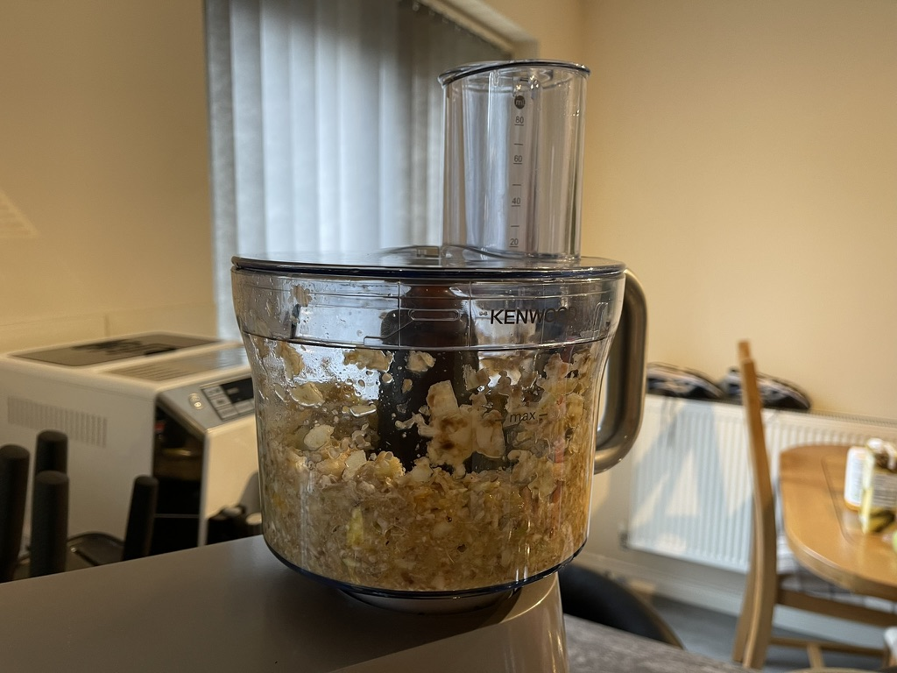
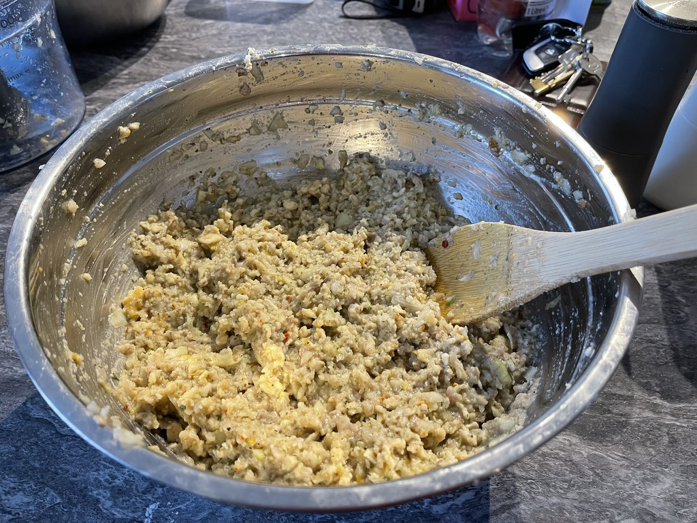
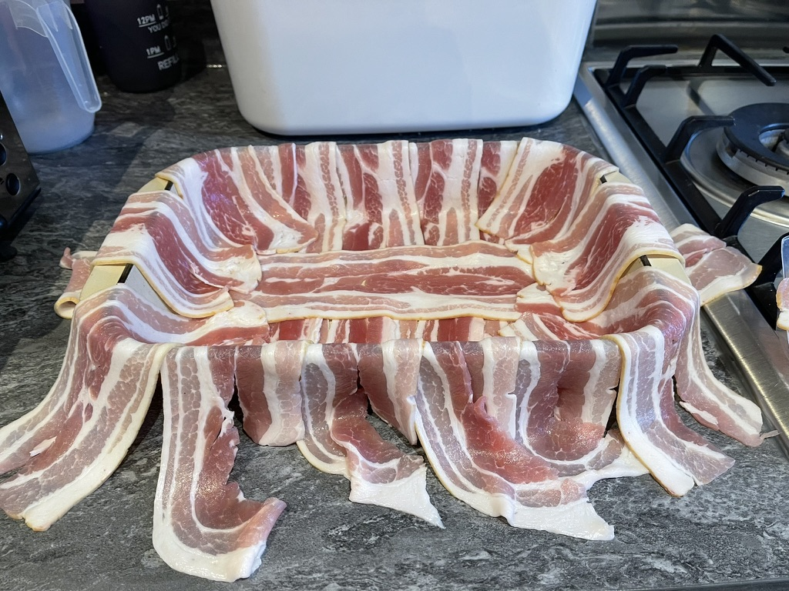
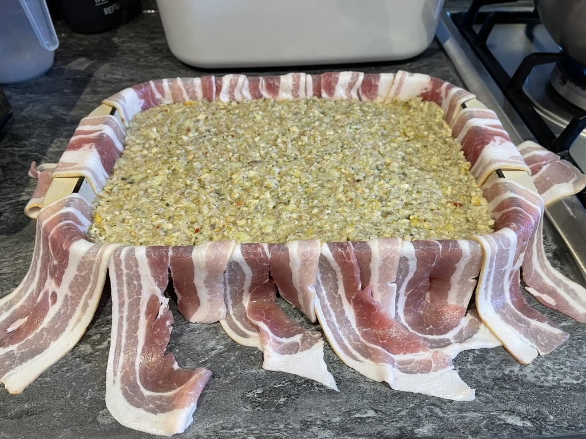
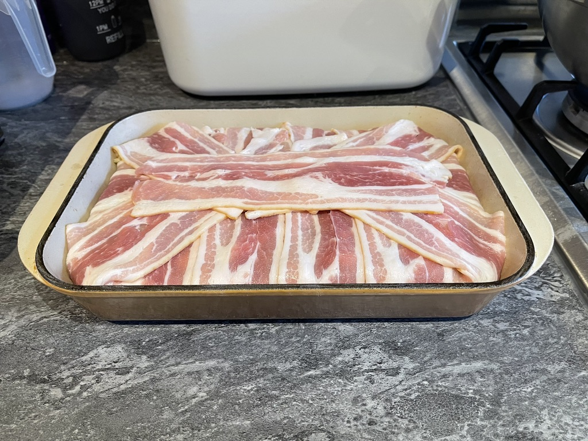
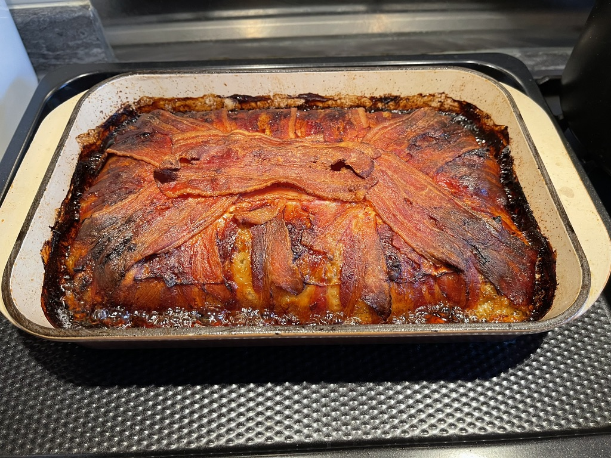
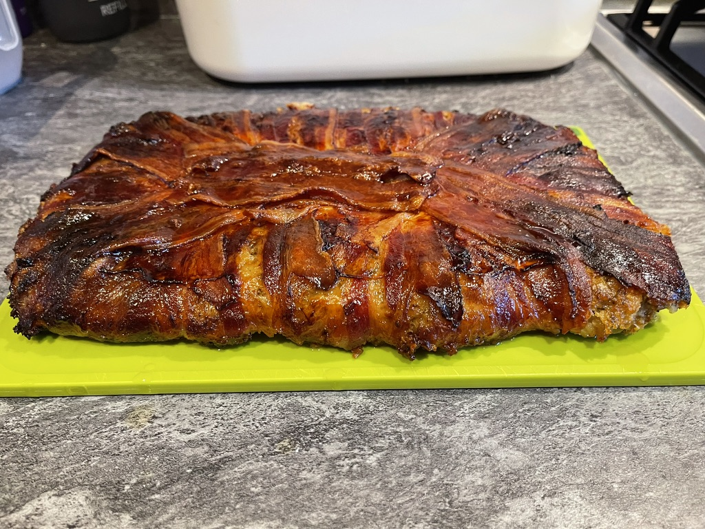

My family have been making this stuffing cake for quite a few years now, and it's a firm favourite of mine throughout the Christmas period. We have it with our Christmas dinner, but it's also great cold either by itself or with onion chutney.

Last year I made this for office bake day, and it went down a treat, so I thought I'd share the recipe here.

There's no exact recipe for this, is more of a chuck it all in and bake in the oven for a long as needed.

## Ingredients

* 1 Large Onion
* 1 Green Apple (Any tart/sour variety works. Granny Smith is a good choice)
* 1 Clementine
* 400g of sausage meat
* 100g Chestnut Mushrooms
* Packet of sage and onion stuffing mix. These are usually around 200g.
* 50g blanched chestnuts (tinned also works fine)
* Tea spoon of chilli flakes
* Enough streaky bacon to line an oven dish (I used ~15 rashers)

## Method

Add the onion, mushrooms, chestnuts, apple, and clementine to a food processor and blitz until roughly chopped. You can also do this by hand if you don't have a food processor.

Put the blitzed ingredients into a large mixing bowl along with the sausage meat and mix well.

Next add the stuffing mix, salt, pepper, and chilli flakes. Mix until everything is combined.

Add boiling water to the mixture until it's a thick paste. I aim for the consistency of thick porridge/oatmeal. Leave to stand for 5 minutes. The stuffing mix will absorb the water and thicken up, so add more water if needed to get the right consistency.

While the stuffing mixture is standing, line an oven dish with the streaky bacon leaving enough overhang to cover the top of the stuffing. I use a 30cm x 20cm dish, but you can use whatever you have to hand. Just make sure it's deep enough to hold the mixture.

Pour the mixture into the oven dish and spread evenly. Fold the overhanging bacon over the top of the stuffing mixture and make sure it's all covered.

Place your oven dish on a baking tray, just in case the oil and juices overflow the dish. Bake in the oven at 180°C / 350°F / Gas Mark 4 for 1 and a half hours. Then turn up to 220°C / 425°F / Gas Mark 7 for 15 minutes to crisp up the bacon. This part can vary a lot based on how deep your oven dish is, and how much water you added, so adjust the cooking time as needed.

Once cooked, remove from the oven and leave to cool before turning out onto a chopping board. Slice and serve.

## Gallery

    
    
    
    
    
    
    

