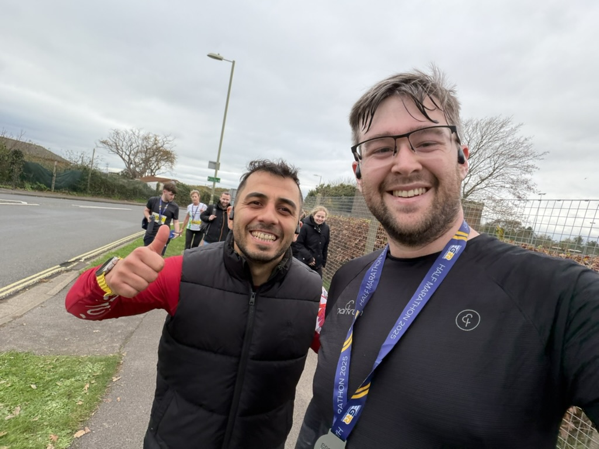

## Why am I here?

Nearly three years ago we found out we were expecting our first child. I knew this would be a significant change to our lifestyle, which was predominantly wake up, sit at a desk, have breakfast, sit at a desk, lunch, desk, dinner, desk, sleep, repeat.

At 125+kg I knew I wasn't able to provide for our new family as best I could. Determined to lose weight and change my lifestyle I completed my first Parkrun. Absolutely hated it. No surprise given I'd spent more than a decade avoiding any sort of exercise.

Despite hating it, I went back the next week, and the week after that. Two and a bit years later, I've now completed 141 Parkruns, shed 30-ish kilograms, running and cycling multiple times a week.

Originally I signed up for Great South Run 2025, however the day before I pulled my back at Parkrun. No idea what happened really, was taking it easy and going slow, knowing the next day I'd be running 10 miles. By the evening everything stiffened up and was having a hard time walking, the next morning was even worse, so unfortunately had to pull out.

## The Con

Thoroughly disappointed having had to skip the Great South Run, [@Zoe](https://zoeaubert.me/) said I should do Gosport Half Marathon instead. As the week went on we both kept talking about it, and eventually I decided to commit, but hadn't yet booked. Apparently [@Zoe](https://zoeaubert.me/) was only joking, but I'd missed that part. I decided to take the joke further and said I'd booked already, so feeling guilty [@Zoe](https://zoeaubert.me/) booked a ticket, and well, now we're both booked in.

[@Zoe](https://zoeaubert.me/) however done an injury the week prior to the Gosport Half, so ended up swapping places with another friend of ours.

## Race Day

Having spoken to several people who have taken part in the Gosport Half in past years, I wasn't particularly looking forward to race day. The course is set along Lee-on-the-Solent sea front, with no protection from the elements. Race day is 16th November, so I'm braced for driving wind and rain. Someone at Parkrun described the Gosport Half as the coldest they'd ever been, and took several baths throughout the day to try and get warm again.

As it turns out, the weather on the day was perfect. Very little wind, completely dry, and a cool 11℃. Ideal running conditions.

My first 5k was easy going, keeping to my planned 6:30/km pace. At this point I'm well warmed up, feeling good, and apparently took off. The next 10k I'd accidentally been running at 6:00/km, even 5:30/km in places. By 15k I'm struggling to keep a 7:00/km, occasionally slowing to a walk, pushing myself to keep a run going. This was largely down to a burning sensation in my feet. Pushing through I managed to finish in [02:19:33](https://results.eventchiptiming.com/myresults.aspx?uid=16202-5322-1-253399).

Overall I'm very happy with that. My main goal for the day was to finish under 02:30:00, stretch goal was 02:15:00. Had I not taken off, I think I'd have managed my stretch goal.

## Reflection

Being my first longer event, I didn't really know what to expect. I could have been better prepared, and stuck to a stricter training programme. I definitely want to take part in more events next year. Largely getting to know about these events is a challenge without having Facebook. Most running groups, and wider society, rely much too much on Facebook, but that's a conversation for another time.

Key takeaways for next time

* Pacing - Keep to my planned pace, even if you're feeling good
* Nutrition - I did bring gels and had one prior to the start, but left them in the car. I'm not really sure why
* Training - I was running 40km/week, and cycling a further 50km/week earlier in the year, but I let this slip due to other commitments and being busy

Next event in my calendar is PJC Pub2Pub 10k. I took part in this last year, struggling up a 250m hill in the rain, barely any grip due to the mud, and little one in the pushchair. Was real good fun.

